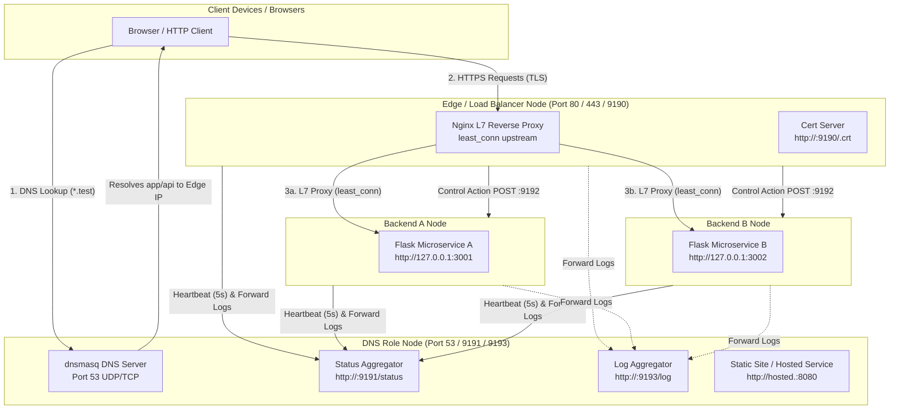

# Vectis

> **Role-based orchestration for private networks**  
> Deploy, operate, monitor, and inject faults across custom DNS (`dnsmasq`), an Edge TLS Load Balancer (`nginx`), and microservice backends — all managed from a single unified CLI.

---

## Table of Contents

- [High-Level Design (HLD) & Architecture](#high-level-design-hld--architecture)
  - [System Architecture Diagram](#system-architecture-diagram)
  - [Roles & Responsibilities](#roles--responsibilities)
  - [Background Agent & Supervision Architecture](#background-agent--supervision-architecture)
- [Protocols & Ports Specification](#protocols--ports-specification)
- [Features](#features)
- [Setup & Installation Guide](#setup--installation-guide)
  - [Prerequisites](#prerequisites)
  - [Installation](#installation)
  - [Deployment Walkthrough (Multi-Machine Setup)](#deployment-walkthrough-multi-machine-setup)
- [CLI Reference](#cli-reference)
- [Hosting Services (`vectis host`)](#hosting-services-vectis-host)
- [Fault Injection & Resilience Testing](#fault-injection--resilience-testing)
- [Frequently Asked Questions (FAQ)](#frequently-asked-questions-faq)
- [License](#license)

---

## High-Level Design (HLD) & Architecture

Vectis provides an end-to-end orchestration framework designed for local development and private team networks. It manages local DNS routing, TLS certificate generation & distribution, Layer 7 HTTP/HTTPS load balancing, multi-service log tailing, and controlled fault-injection testing.

### System Architecture Diagram



---

### Roles & Responsibilities

Vectis supports 6 configurable node roles:

| Role Name | Identifier | Key Services Run | Port Allocations | Description |
| :--- | :--- | :--- | :--- | :--- |
| **DNS Server** | `dns` | `dnsmasq`, Status Aggregator, Log Aggregator, Control Listener | 53 (DNS), 9191 (Status), 9193 (Logs), 9192 (Control) | Manages wildcard DNS resolution (`*.<domain>`), host telemetry dashboard, and log collection. |
| **Edge / Load Balancer** | `edge` | `nginx` L7 Proxy, Cert HTTP Server, Control Listener | 80 (HTTP), 443 (HTTPS), 9190 (Cert Distribution), 9192 (Control) | Generates SSL certs, terminates TLS, and proxies traffic using `least_conn` to backends. |
| **Backend A** | `backend_a` | Flask Microservice A, Control Listener | 3001 (Backend A), 9192 (Control) | Handles API requests for Backend A, returning `X-Backend: backend_a` header. |
| **Backend B** | `backend_b` | Flask Microservice B, Control Listener | 3002 (Backend B), 9192 (Control) | Handles API requests for Backend B, returning `X-Backend: backend_b` header. |
| **DNS + Edge Combo** | `dns_edge` | `dnsmasq`, `nginx`, Aggregators, Cert Server, Control Listener | 53, 80, 443, 9190, 9191, 9192, 9193 | Combined DNS and Edge role for single-host deployments. |
| **Backend A + B Combo**| `backends` | Flask Microservices A & B, Control Listener | 3001, 3002, 9192 | Combined backends on a single physical host. |

---

### Background Agent & Supervision Architecture

When `vectis setup` completes, it spawns a long-running foreground background agent. The agent runs the following daemon threads:

1. **Heartbeat Thread**: Pushes node status and health checks to the DNS machine every 5 seconds.
2. **Control Listener Thread**: Listens on TCP port `9192` for RPC actions (e.g., remote kill commands issued by `vectis fault`).
3. **Supervisor Thread**: Continuously verifies local service health (`dnsmasq`, `nginx`, Flask backends) and automatically attempts restarts if a process fails.
4. **Log Forwarder Thread**: Tails local log files in real-time and forwards entries to the DNS machine for central aggregation.

> [!IMPORTANT]
> The background agent **must remain running** for process supervision, telemetry heartbeats, log forwarding, and remote fault handling to function. Use Ctrl+C in the terminal to stop the agent.

---

## Protocols & Ports Specification

Vectis utilizes explicit networking protocols for core traffic, control signaling, and telemetry across the private LAN:

| Port | Protocol | Layer / Type | Role Host | Purpose & Description |
| :--- | :--- | :--- | :--- | :--- |
| **53** | `UDP / TCP` | Layer 4 / DNS | `dns`, `dns_edge` | **Domain Name System**: `dnsmasq` answers wildcard DNS lookups for `*.<domain>` (e.g. `app.<domain>`, `api.<domain>`, `hosted.<domain>`). |
| **80** | `HTTP` | Layer 7 | `edge`, `dns_edge` | **HTTP Traffic / Redirects**: Nginx HTTP server for plain requests and HTTPS redirects. |
| **443** | `HTTPS (TLS 1.2/1.3)` | Layer 7 | `edge`, `dns_edge` | **Secure TLS Termination**: Nginx reverse proxy routing `app.<domain>` and `api.<domain>` to upstream backends via `least_conn`. |
| **3001** | `HTTP` | Layer 7 | `backend_a`, `backends` | **Backend A Microservice**: Flask app serving API requests and `/api/status`. |
| **3002** | `HTTP` | Layer 7 | `backend_b`, `backends` | **Backend B Microservice**: Flask app serving API requests and `/api/status`. |
| **8080** | `HTTP` | Layer 7 | `dns`, `dns_edge` | **Static Site / Monorepo Host**: Default port for content hosted via `vectis host`. |
| **9190** | `HTTP` | Layer 7 | `edge`, `dns_edge` | **LAN Certificate Distribution**: Serves the public CA/SSL certificate (`.crt`) so peer nodes can pull it via `curl`. |
| **9191** | `HTTP (REST/JSON)` | Layer 7 | `dns`, `dns_edge` | **Status Dashboard & Telemetry**: Receives node heartbeats (`POST /report`) and renders team health dashboard (`GET /status`). |
| **9192** | `HTTP (RPC/JSON)` | Layer 7 | All Nodes | **Control Channel**: Listens for remote action commands (`POST /control`), such as controlled fault injection kills. |
| **9193** | `HTTP (Stream/JSON)` | Layer 7 | `dns`, `dns_edge` | **Team Log Aggregator**: Receives streamed log lines (`POST /log`) from all node log forwarders. |
| N/A | `macOS System Resolver` | OS Integration | Local Machine | **macOS Split Resolver**: Configures `/etc/resolver/<domain>` so local OS lookups for `*.<domain>` resolve to the DNS machine IP without overriding global DNS. |

---

## Features

- **Single CLI Control Plane**: Unified interactive menu and direct subcommands for complete network lifecycle management.
- **Automated TLS & Cert Trust**: Automatic TLS certificate generation (`mkcert` with `openssl` fallback), LAN distribution, and automatic macOS Keychain trust installation (`vectis trust-cert`).
- **macOS OS Resolver Integration**: Seamlessly routes local browser requests for `*.<domain>` directly to the team DNS server via macOS `/etc/resolver/<domain>`.
- **L7 Load Balancing with Failover**: Nginx configured with `least_conn` strategy to protect recovering backends from traffic surges after restart events.
- **Centralized Log Aggregation**: Multi-machine log forwarding with unified real-time log tailing across the deployment (`vectis logs --team`).
- **Controlled Fault Injection**: Simulated service kills and DNS poisoning (`vectis fault`) to validate backend failover and self-healing.
- **Local Service Hosting**: Host static sites or monorepo microservices directly on the DNS machine with instant `hosted.<domain>` DNS registration (`vectis host`).

---

## Setup & Installation Guide

### Prerequisites

- **OS**: macOS (recommended for native `/etc/resolver` & Keychain integration) or Linux.
- **Python**: `>= 3.11`
- **System Tools (Installed via Homebrew on macOS)**:
  - `dnsmasq` (for DNS role)
  - `nginx` (for Edge role)
  - `mkcert` (optional, for locally trusted TLS certificates)

---

### Installation

1. **Clone the Repository**:
   ```bash
   git clone https://github.com/ElusiveParadox/vectis.git
   cd vectis
   ```

2. **Create Virtual Environment & Install**:
   ```bash
   python3 -m venv .venv
   source .venv/bin/activate
   pip install -e .
   ```

3. **Verify CLI**:
   ```bash
   vectis --help
   ```

---

### Deployment Walkthrough (Multi-Machine Setup)

Deploying a complete 4-machine architecture (`DNS`, `Edge`, `Backend A`, `Backend B`):

```
+------------------+      +------------------+      +------------------+      +------------------+
|    DNS Machine   |      |   Edge Machine   |      | Backend A Machine|      | Backend B Machine|
|  192.168.1.10    |      |   192.168.1.20   |      |   192.168.1.30   |      |   192.168.1.40   |
+------------------+      +------------------+      +------------------+      +------------------+
```

#### Step 1: Configure DNS Node (`192.168.1.10`)
Run setup on the DNS machine:
```bash
vectis setup
```
- Select role: `DNS server`
- Enter domain: `team1.test`
- Confirm network interface & IP (`192.168.1.10`)
- Confirm macOS resolver prompt to enable browser access

#### Step 2: Configure Backend Nodes (`192.168.1.30` & `192.168.1.40`)
On Backend A host:
```bash
vectis setup
```
- Select role: `Backend A`
- Enter domain: `team1.test`
- Enter DNS machine IP: `192.168.1.10`

On Backend B host:
```bash
vectis setup
```
- Select role: `Backend B`
- Enter domain: `team1.test`
- Enter DNS machine IP: `192.168.1.10`

#### Step 3: Configure Edge Node (`192.168.1.20`)
On the Edge machine:
```bash
vectis setup
```
- Select role: `Edge / load balancer`
- Enter domain: `team1.test`
- Enter DNS machine IP: `192.168.1.10`
- Input Backend A IP (`192.168.1.30`) and Backend B IP (`192.168.1.40`) when prompted.
- Note the printed `curl` command for pulling the SSL certificate.

#### Step 4: Distribute & Trust SSL Certificate
On all client / peer machines, execute the `curl` command printed by Edge:
```bash
curl --create-dirs -o "$HOME/.config/vectis/certs/pulled/team1.test.crt" http://192.168.1.20:9190/team1.test.crt
```
Then run trust command on each client:
```bash
vectis trust-cert
```

#### Step 5: Verify Deployment
- **Status Dashboard**: Open `http://192.168.1.10:9191/status` in your browser.
- **Web App**: Open `https://app.team1.test` or `https://api.team1.test` in your browser.
- **Team Logs**: Run `vectis logs --team` on any machine to stream unified network logs.

---

## CLI Reference

Launch interactive menu by running bare `vectis`, or use direct subcommands:

```
vectis [COMMAND] [OPTIONS]
```

| Command | Subcommand Options | Description |
| :--- | :--- | :--- |
| `vectis` | `--debug` | Drops into interactive menu. Pass `--debug` for full tracebacks. |
| `vectis setup` | `--role-name <NAME>`<br>`--no-foreground` | Configures dependencies, network state, and runs smoke tests. Use `--no-foreground` for non-blocking script runs. |
| `vectis status` | None | Displays configured role, domain, peer addresses, and last smoke test results. |
| `vectis logs` | `--team` | Tails live service logs. Use `--team` for cross-machine central logs. |
| `vectis fault` | None | Triggers failure injection menu (kill services, DNS poison tests). Gated to server roles. |
| `vectis trust-cert` | None | Automatically installs the pulled domain certificate into the local macOS login keychain. |
| `vectis host` | None | Serves static sites or monorepo web apps on port 8080 and registers `hosted.<domain>`. |
| `vectis reset` | `--hard` | Stops locally owned processes. `--hard` removes config, certs, system resolvers, and stops `dnsmasq`/`nginx`. |

---

## Hosting Services (`vectis host`)

The DNS machine can host static sites or monorepo microservices without requiring Nginx proxy re-configurations:

### 1. Static Site Hosting
Point `vectis host` to any folder containing HTML/CSS assets. Serves static files over HTTP on port `8080` and registers `http://hosted.<domain>:8080`.

### 2. Monorepo Microservice Hosting
Provide a directory path, start command (e.g. `npm run dev`), and port number. Vectis injects the `PORT` environment variable into the child process, verifies reachability, and automatically updates `dnsmasq` to point `hosted.<domain>` to the DNS host.

---

## Fault Injection & Resilience Testing

To test microservice failover and high availability:

1. Run `vectis fault` from an Edge or DNS node.
2. Select a target action (e.g. **Stop Backend A**).
3. The server sends a control RPC (`POST http://<backend-a-ip>:9192/control`) to terminate Backend A's process.
4. **Result Verification**:
   - The status dashboard (`http://<dns-ip>:9191/status`) updates Backend A to `fault`.
   - Nginx immediately routes 100% of HTTPS traffic to Backend B without breaking active user sessions.
   - The local supervisor thread on Backend A detects the failure and automatically restarts the process after backoff.
   - Once Backend A recovers, Nginx's `least_conn` routing gradually shifts connections back as it warms up.

---

## Frequently Asked Questions (FAQ)

### Q1: Why do `dnsmasq` and `nginx` require `sudo` to restart or stop?
**Answer**: On macOS and Linux, network ports below `1024` (such as DNS port `53` and HTTPS port `443`) are privileged ports requiring root permissions. Running `brew services restart` without `sudo` may falsely output "Successfully started" while the process silently fails to bind the port. Vectis invokes `sudo brew services restart` to ensure processes bind privileged ports correctly.

---

### Q2: Why is TLS certificate distribution handled over plain HTTP instead of QUIC or Bluetooth?
**Answer**:
1. **QUIC Circular Dependency**: QUIC is built on TLS 1.3. Using QUIC to distribute a TLS root/domain certificate creates a circular bootstrapping failure—you would need a trusted TLS channel to execute the QUIC handshake to fetch the cert used for TLS.
2. **Bluetooth Limitations**: macOS CLI surfaces for Bluetooth file transfer (AirDrop/OBEX) lack stable, un-prompted scripting APIs. Plain HTTP on port `9190` provides a fast, reliable transport across the shared LAN.

---

### Q3: Why is the Status Dashboard hosted on the DNS machine instead of the Edge machine?
**Answer**: The Edge node is frequently the target of intentional failure testing (killing Nginx, testing network interruptions, or fault injections). If the dashboard were hosted on Edge, the ops view would crash exactly when you need to monitor the failure. The DNS node remains active and reachable throughout edge failure scenarios.

---

### Q4: Why use `least_conn` instead of default Round-Robin in Nginx?
**Answer**: Round-robin distributes incoming HTTP requests equally regardless of backend server state. Immediately after a backend recovers from a crash or restart, round-robin would instantly bombard it with 50% of total traffic before it has warmed up. `least_conn` sends traffic to backends with fewer active connections, giving restarted nodes time to recover naturally.

---

### Q5: Why does Vectis use Layer 7 (L7) load balancing instead of Layer 4 (L4/NLB)?
**Answer**: Layer 7 load balancing (HTTP/HTTPS reverse proxying) decrypts TLS and inspects HTTP headers. This allows Vectis to perform hostname-based routing (e.g., routing `app.<domain>` vs `api.<domain>`), inject custom HTTP response headers (such as `X-Backend`), and execute HTTP health checks. Layer 4 (TCP passthrough) operates below TLS and cannot inspect hostnames or headers.

---

### Q6: How does the background agent stay alive, and what happens when I exit?
**Answer**: `vectis setup` starts background threads for heartbeats, process supervision, RPC listening, and log tailing. In foreground mode (default), `vectis` blocks in a Rich live panel. Pressing Ctrl+C exits the foreground process cleanly. Processes managed by `brew` (`dnsmasq`, `nginx`) remain running in the background. To completely clean up state, run `vectis reset --hard`.

---

### Q7: How does macOS `/etc/resolver` work, and why is it safer than changing system DNS?
**Answer**: macOS supports split-horizon DNS via files in `/etc/resolver/<domain>`. Creating `/etc/resolver/team1.test` instructs macOS to direct DNS queries ending in `.team1.test` to the Vectis DNS server IP (`192.168.1.10`), while all other queries (e.g. `google.com`) continue using your normal Wi-Fi / system DNS. Running `vectis reset --hard` automatically deletes this resolver file.

---

## License

Distributed under the MIT License. See `LICENSE` for details.
